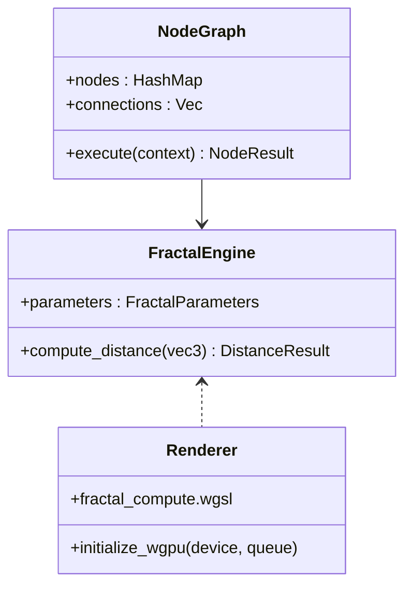

# Modular Fractal Shader — Current State (November 2025)

A modular fractal generator built with Rust and Bevy. This README reflects the actual implementation status and serves as a living document that evolves with the code.

## 🚀 Status Overview

- ✅ Bevy 0.17 + bevy_egui integration for desktop GUI
- ✅ Core fractal engine with CPU-based distance estimation (Mandelbrot, Julia, Mandelbulb, Mandelbox, more)
- ✅ Basic viewport and parameter panels
- 🚧 GPU renderer integration (WGSL compute/render) in progress
- 🚧 Node system: data model implemented; editor UI not implemented yet
- 🚧 Export: placeholder mesh/image exporters (non-fractal meshes)
- 🚧 Animation: keyframe/timeline structures present; no timeline UI yet
- ❌ Advanced features (GI, volumes, VR/AR, gesture, NFT) not implemented

## 📚 What’s Implemented vs Planned

### Implemented
- Fractal mathematics and distance estimation in `src/fractal/engine.rs`
- Bevy-based GUI scaffolding in `src/gui.rs` with viewport texture binding
- Basic parameter handling, color palettes, and metrics

### Partial
- GPU/WGPU setup with backend preflight and logging
- Viewport image binding for Camera3d → egui texture
- Exporters stubbed (OBJ/STL/PLY ASCII basics)

### Planned
- Visual node editor (drag-and-drop, connectors, groups)
- GPU compute path for fractal evaluation and shading
- Timeline editor, audio/MIDI integration
- Proper mesh extraction from DE fields and voxel formats

## 🧭 Architecture (High Level)

```mermaid
flowchart LR
    A[GUI (Bevy + bevy_egui)] --> B[FractalStudioApp]
    B --> C[Fractal Engine (CPU)]
    B --> D[Renderer (GPU/WGPU) ~ in progress]
    B --> E[Node System (data model)]
    B --> F[Animation (structures)]
    B --> G[Export (placeholders)]
    C -->|DE results| D
    E -->|Graphs/Params| C
    F -->|Param drives| C
    G -->|Images/Meshes| H[Disk]
```

## ✨ Features (Honest Snapshot)

### Fractal Generation
- ✅ 2D: Mandelbrot, Julia, Burning Ship, Tricorn
- ✅ 3D: Mandelbulb, Mandelbox; distance estimators on CPU
- 🚧 Quaternion Julia, Kaleidoscopic IFS: basic math present

### Controls
- ✅ Real-time parameter updates (iterations, bailout, palette, etc.)
- 🚧 Camera controls and lighting: minimal; PBR pipeline not wired

### Node-Based System
- ✅ Data model: `Node`, `NodeGraph`, `NodeConnection`, `DataType`
- ✅ Generators/Math/Color/Transform/Output enums
- 🚧 Execution logic is simplified; editor UI missing
- ➜ See `docs/NODE_SYSTEM.md` for details and roadmap

### Rendering & Performance
- ✅ Ray-marching math and DE routines on CPU
- 🚧 WGSL shaders and GPU path wiring
- 🚧 Adaptive quality and performance presets

### Export
- 🚧 ASCII OBJ/STL/PLY basics; placeholder cube export
- 🚧 Snapshot PNG pipeline (alpha)

### Platform
- ✅ Desktop (Windows/macOS/Linux)
- ℹ️ Web/WASM lives elsewhere; see `docs/PLATFORM_SPLIT.md`

## 📦 Installation

[](https://www.rust-lang.org/)
[](https://bevyengine.org/)
[](LICENSE)

## ✨ Features

### 🎨 **Fractal Generation**
- **2D Fractals**: Mandelbrot, Julia, Burning Ship, Tricorn, Phoenix
- **3D Fractals**: Mandelbulb, Mandelbox, Menger Sponge, Quaternion Julia
- **Hybrid Fractals**: BulbBox, Amazing Box, Kaleidoscopic IFS
- **Procedural**: Generic spirals, torus, helix, vortex patterns
- **Distance Estimation**: GPU-accelerated real-time rendering

### 🎛️ **Interactive Control System**
- **Real-time Parameters**: Zoom, iterations, power, bailout, rotation
- **Color Control**: Customizable palettes and gradient mapping
- **Transform Controls**: Position, scale, rotation, folding parameters
- **Fractal-specific**: Mandelbulb power, Mandelbox folding, IFS transforms

### 🎯 **Node-Based Composition**
- **Visual Node Editor**: Drag-and-drop fractal composition
- **Generator Nodes**: 2D/3D fractals, noise, mathematical functions
- **Transform Nodes**: Position, scale, rotate, warp operations
- **Effect Nodes**: Color correction, geometry transforms, filters
- **Animation Nodes**: Timeline control, LFO oscillators, noise generators

### 🚀 **Performance & Compatibility**
- **GPU Acceleration**: WebGPU/Vulkan/Metal/DX12 support
- **Real-time Rendering**: 60+ FPS on modern GPUs
 - **Cross-Platform**: Windows, macOS, Linux (desktop-only)
- **Memory Efficient**: Optimized resource management

### 🎬 **Animation & Motion**
- **Keyframe Animation**: Professional timeline with interpolation
- **Procedural Animation**: L-systems, noise, attractors
- **Camera Animation**: Cinematic camera movement
- **Parameter Automation**: Dynamic fractal parameter changes

### 🎨 **Rendering Pipeline**
- **Ray Marching**: Real-time distance field rendering
- **Adaptive Quality**: Automatic LOD based on performance
- **Professional Viewport**: 3D navigation and camera controls
- **Material System**: PBR materials with metallic/roughness workflow

### 📺 **Real-time Output**
- **Multi-Display**: Support for complex display setups
- **Viewport Controls**: Professional camera and navigation tools
- **Interactive Controls**: Real-time parameter adjustment
- **Export Preview**: WYSIWYG export preparation

### 🎮 **Professional UI/UX**
- **Dark Theme**: Modern dark interface with glassmorphism
- **Customizable Workspaces**: Multiple layout configurations
- **Context Menus**: Right-click context-sensitive actions
- **Keyboard Shortcuts**: Efficient workflow optimization

## 📦 Installation

### Prerequisites
- Rust 1.70+
- Vulkan/Metal/DX12 compatible GPU
- Audio device (optional, for audio features)
- MIDI device (optional, for MIDI control)

### From Source
```bash
git clone https://github.com/compiling-org/modular-fractal-shader
cd modular-fractal-shader
cargo build --release
```

## Documentation Suite
- `docs/FEATURES_STATUS.md` — Implemented vs partial vs planned (living)
- `docs/NODE_SYSTEM.md` — Node system design, status, diagrams
- `docs/DEVELOPMENT_PLAN.md` — Phases, goals, acceptance criteria
- `docs/DEVELOPMENT_ROADMAP.md` — Milestones and priorities
- `docs/DOCS_MAINTENANCE.md` — Update cadence and protocols

Documents are living and updated alongside code changes.

## ⚠️ GPU Policy

- Prefer discrete GPU; logs diagnostics and continues if unavailable
- Backend preflight sets `WGPU_BACKEND` and compiler hints on Windows
- Recommended environment configuration before running:
  - Windows: `WGPU_BACKEND=vulkan,dx12`, `WGPU_POWER_PREF=high`, `WGPU_DX12_COMPILER=fxc`
  - macOS: `WGPU_BACKEND=metal`, `WGPU_POWER_PREF=high`
  - Linux: `WGPU_BACKEND=vulkan`, `WGPU_POWER_PREF=high`
- See `gpu_startup.log` after launch for adapter diagnostics

### Required Run Commands

- PowerShell (Windows):

```
$env:WGPU_BACKEND = 'vulkan,dx12'
$env:WGPU_POWER_PREF = 'high'
$env:WGPU_DX12_COMPILER = 'fxc'
cargo run --features gui
```

- Git Bash (Windows):

```
export WGPU_BACKEND='vulkan,dx12'
export WGPU_POWER_PREF='high'
export WGPU_DX12_COMPILER='fxc'
cargo run --features gui
```

- macOS/Linux:

```
export WGPU_BACKEND='metal'   # macOS
export WGPU_BACKEND='vulkan'  # Linux
export WGPU_POWER_PREF='high'
cargo run --features gui
```

If the app exits with a message about “GPU device not available — GPU-only policy enforced,” verify drivers and backend selection.

### Docs-First Workflow

- Update relevant docs in the same PR as code changes
- Use status tags: Implemented / Partial / Planned
- Keep `docs/FEATURES_STATUS.md` and `docs/NODE_SYSTEM.md` current

Track Current Issues:
- Known problems and planned fixes live in `docs/ISSUES_TRACKER.md`.
- When you discover a new issue or change an issue’s status, update the tracker in the same PR.
- Keep repro steps and acceptance criteria precise; this makes triage and validation fast.

## 🎮 Usage

### Basic Usage
```bash
# Start GUI application
cargo run

# Run performance benchmarks
cargo run -- benchmark

# Run compatibility tests
cargo run -- test
```

### Fragment Pseudo‑3D Mode (Experimental)
The fragment path is exploratory and not wired to production UI. Expect limited functionality.

### DE→Color Mapping (Alpha)
- Modes: off, grayscale by depth, multiply base
- Parameters exist; UI and shader wiring are evolving

### Node Editor Demo
```bash
cargo run --example node_editor_demo
```

### Fractal Rendering Demo
```bash
cargo run --example fractal_demo
```

### CLI Mesh Export (alpha)
```bash
# Export a placeholder OBJ mesh (cube) to exports/mesh.obj
cargo run --bin mesh_export -- --output exports/mesh.obj --width 32 --height 32 --depth 32
```
- Current behavior exports a placeholder cube (non-fractal)
- Intended roadmap: load a `.fract` project, evaluate scene objects, and export meshes per object parameters.
- Flags: `--output <path>`, `--width <w>`, `--height <h>`, `--depth <d>` (defaults: `exports/mesh.obj`, `32`, `32`, `32`).

### CLI Snapshot (alpha)
Render a single PNG using the CPU path; WGSL integration is in progress.

```bash
# Default snapshot (1024x768, Mandelbulb)
cargo run --bin fractal-snapshot

# Snapshot with camera, lighting, DE→color, and tonemapping controls
cargo run --bin fractal-snapshot -- '{
  "width": 1024,
  "height": 768,
  "formula": "mandelbulb",
  "camera_fov": 60.0,
  "light_direction": [0.4, 0.7, -0.2],
  "light_color": [0.8, 0.9, 1.0],
  "light_intensity": 1.0,
  "material_metallic": 0.0,
  "material_roughness": 0.5,
  "de_color_mode": 1,
  "de_color_scale": 0.2,
  "tonemap": "reinhard",
  "exposure": 1.2,
  "output": "snapshot.png"
}'
```

- DE→color: `de_color_mode` (`0` off, `1` grayscale by depth, `2` multiply base), `de_color_scale` (depth scale).
- Tonemapping: `tonemap` (`none` | `reinhard`), `exposure` (positive float).
- Camera & lighting: `camera_fov` (degrees), `light_direction` (xyz), `light_color` (rgb), `light_intensity`, `material_metallic`, `material_roughness`.

### Platform Split
Desktop-only in this repository. Web/WASM builds live in NUWE; see `docs/PLATFORM_SPLIT.md`.

### Web Deployment
- The browser/WASM edition lives in the NUWE blockchain project.
- This repo focuses on native desktop builds; web API/UI code is relocated.
- For details and links to the web codebase, see `docs/PLATFORM_SPLIT.md`.

## 🏗️ Modules

- `FractalEngine` — CPU DE math and coloring
- `Renderer` — WGSL shaders and GPU wiring (in progress)
- `Nodes` — Data model and execution stubs
- `Animation` — Keyframe/timeline structures
- `Scene` — Cameras and basic 3D setup
- `Export` — ASCII mesh/image placeholders

## 🎨 Node Types (Implemented)

- Generators: Mandelbrot, Julia, Mandelbulb, Mandelbox, IFS (data model)
- Math: Add, Multiply, Sine, Cosine, Absolute, etc.
- Color: Invert, Brightness (basic)
- Transform: Scale (basic)
- Output: Pass-through

See `docs/NODE_SYSTEM.md` for full details and planned nodes.

## 🔧 Development

### Building
```bash
# Debug build
cargo build

# Release build (optimized)
cargo build --release

# Run tests
cargo test

# Run examples
cargo run --example node_editor_demo
cargo run --example fractal_demo
```

### Project Structure
```
src/
├── main.rs              # Application entry point
├── lib.rs               # Library interface
├── gui.rs               # Bevy GUI implementation
├── fractal/             # Fractal engine
│   ├── mod.rs
│   ├── engine.rs
│   ├── formulas.rs
│   ├── renderer.rs
│   └── types.rs
├── ui/                  # User interface
│   ├── mod.rs
│   ├── main.rs
│   ├── node_editor.rs
│   ├── theme.rs
│   └── fractal_ui.rs
├── scene/               # 3D scene management
│   └── mod.rs
├── animation/           # Animation system
│   ├── mod.rs
│   ├── timeline.rs
│   └── keyframe.rs
├── export/              # Export functionality
│   └── mod.rs
├── benchmark.rs         # Performance benchmarking
├── project.rs           # Project management
└── nodes.rs             # Node definitions

docs/                    # Documentation
examples/                # Example applications
assets/                  # Shaders and resources
```

## 🎯 Roadmap (Condensed)

- Foundation: GPU renderer, node editor UI, mesh export from DE
- Core: timeline editor, audio/MIDI, camera+lighting controls
- Advanced: volumes, GI, VR/AR, collaboration, plugins

## 🤝 Contributing

Contributions are welcome! Please feel free to submit a Pull Request.

### Development Guidelines
1. Follow Rust coding standards
2. Add tests for new features
3. Update documentation
4. Ensure cross-platform compatibility

### Docs-First Workflow (Required)
- All code changes must be paired with documentation updates.
- CI includes a Docs Gate that fails PRs with code changes unless `docs/` files are updated.
- PRs must link updated docs and acceptance criteria (see `.github/PULL_REQUEST_TEMPLATE.md`).
- Commit messages should include a `Docs:` section or links to updated docs. Use `Doc-Exempt` only for trivial infra/typo commits.

#### Install Git Hooks (Windows)
- Install local hooks to enforce docs-first commits:
  - PowerShell: `powershell -ExecutionPolicy Bypass -File scripts/install_hooks.ps1`
  - Or: `pwsh -File scripts/install_hooks.ps1`
- Hooks installed: `pre-commit` (blocks code-only commits), `commit-msg` (nudges to include docs context).

#### Required Docs to Update
- At least one of:
  - `docs/DEVELOPMENT_PLAN.md`
  - `docs/DEVELOPMENT_ROADMAP.md`
  - `docs/GAP_ASSESSMENT.md`
  - Relevant module plans (e.g., `docs/VR_XR_INTEGRATION_PLAN.md`, `docs/GESTURE_INPUT_PLAN.md`)
- Reference: `docs/DOCS_MAINTENANCE.md` — Living Docs Protocol and automation.

## 📄 License

This project is licensed under the MIT License - see the [LICENSE](LICENSE) file for details.

## 🙏 Acknowledgments

- **Bevy Engine** - For the amazing Rust game engine
- **WebGPU/WGSL** - For modern GPU compute capabilities
- **Rust Community** - For the excellent ecosystem
- **Fractal Community** - For the inspiration and algorithms

## 📞 Contact

- **Repository**: [GitHub](https://github.com/compiling-org/modular-fractal-shader)
- **Issues**: [GitHub Issues](https://github.com/compiling-org/modular-fractal-shader/issues)
- **Discussions**: [GitHub Discussions](https://github.com/compiling-org/modular-fractal-shader/discussions)

---

**Made with ❤️ and lots of fractals**
## Desktop UI Theme Controls

- The project is desktop-focused; no server or web preview is required.
- See `docs/THEME_CONTROLS.md` for usage and implementation details.