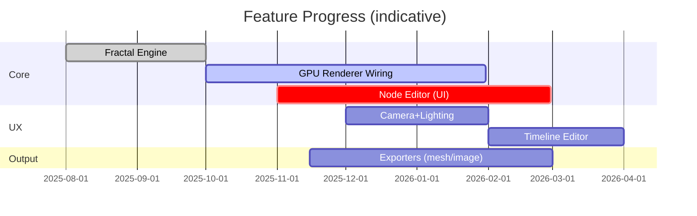

# Features Status — November 2025

Accurate snapshot of implemented, partial, and planned capabilities.

## Rendering & Shading
- Implemented: CPU distance estimators; basic coloring
- Partial: WGSL shaders present; GPU wiring in progress
- Partial: Basic Reinhard tonemapping; vignette fix; bloom hooks only
- Planned: Lighting (directional/ambient), shadows, PBR materials

## Camera & Controls
- Implemented: Basic 3D/2D camera setup and viewport binding
- Missing: Cinematic controls (FOV/aperture/DoF/paths)
- Planned: Dedicated Modeling vs Rendering workspaces

## Node-Based System
- Implemented: Data model (`Node`, `NodeGraph`, `NodeConnection`, `DataType`)
- Partial: Simplified execution for math/color/transform
- Missing: Visual editor UI, grouping, subgraphs, profiling
- See `docs/NODE_SYSTEM.md`

## Fractal Formulas
- Implemented: Mandelbrot, Julia, Burning Ship, Tricorn, Mandelbulb, Mandelbox
- Partial: Quaternion Julia, Kaleidoscopic IFS math
- Planned: Menger, Sierpinski, Apollonian refinements and hybrids

## Export
- Partial: OBJ/STL/PLY ASCII placeholders; cube export
- Planned: FBX/glTF/VOX/QUB writers; image sequences; CLI batch

## Animation
- Partial: Keyframe/timeline structures
- Missing: Timeline UI, playback, easing curves
- Planned: Parameter drivers (noise/OSC/MIDI), baking

## Audio/MIDI/OSC/Gesture
- Partial: Systems scaffolded; minimal wiring
- Missing: Real-time analysis, mappings, presets
- Planned: Live performance profiles and visual feedback

## Recent Work
- Viewport image registration with egui texture
- GPU backend preflight and diagnostics logging
- Basic ASCII STL/PLY exporters scaffolded
- Vignette fix and minimal tonemapping

## Next Priorities
- Wire WGSL compute/render into viewport
- Build visual node editor and execution bridge
- Implement simple lighting and camera controls
- Expand formula library and parameter bindings