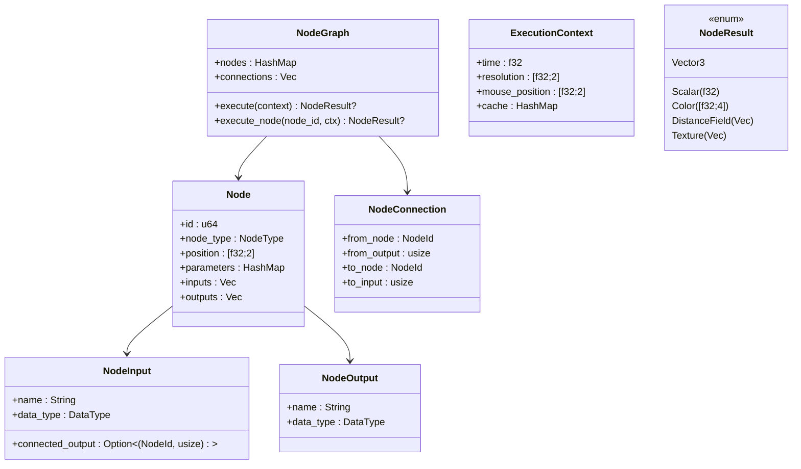
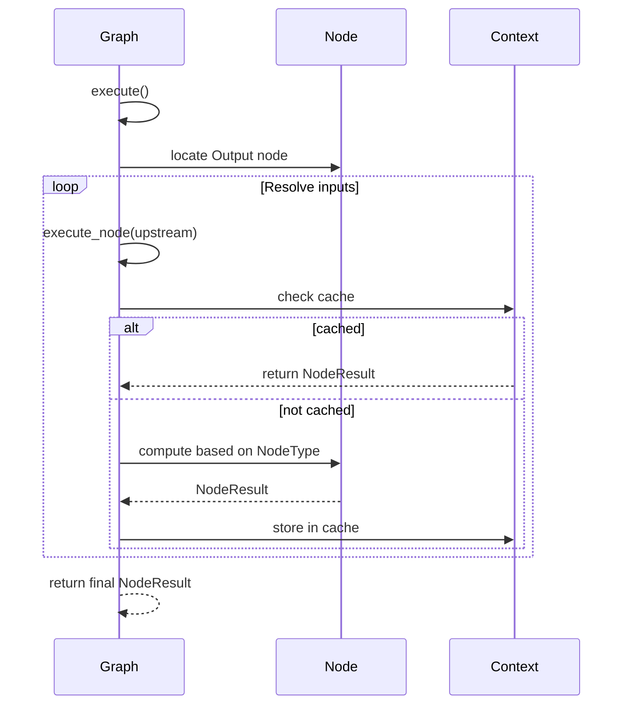

# Node System — Design, Status, and Roadmap

This document describes the node-based system: current capabilities, planned features, and how nodes execute and interoperate.

## Status Snapshot

- Implemented: Data model (`Node`, `NodeGraph`, `NodeConnection`, `NodeParameter`, `DataType`)
- Implemented: Enums for `FractalType`, `MathOperation`, `ColorOperation`, `NodeType`
- Partial: Execution paths for math/color/transform; simplified fractal generators
- Missing: Visual editor UI (drag, connect, group), profiling, caching strategies, undo/redo

## Data Model



## Node Types (Implemented)

- Generators: `FractalGenerator(FractalType)`
  - FractalType: Mandelbrot, Julia, Mandelbulb, Mandelbox, IFS, Custom
- Math: `Add`, `Subtract`, `Multiply`, `Divide`, `Power`, `Sine`, `Cosine`, `Absolute`, `Clamp`
- Color: `Brightness`, `Contrast`, `Saturation`, `HueShift`, `Invert`, `Gamma`
- Transform: basic scale transform
- Output: pass-through

## Execution Semantics



Notes:
- Type safety enforced at connection time (input/output `DataType` must match)
- Execution uses DFS with memoization via `ExecutionContext.cache`
- Fractal generators currently produce simplified distance fields

## Planned Enhancements

- Visual Editor UI
  - Drag-and-drop nodes, connectors, snapping, frames, comments
  - Group/subgraph nodes; macro nodes; presets palette
  - Undo/redo; copy/paste; alignment helpers

- Execution & Performance
  - GPU-backed evaluation for DistanceField/Texture nodes
  - Caching strategies and invalidation
  - Profiling overlay (execution time per node)

- Node Library Expansion
  - Transforms: translate/rotate/scale, warp/twist/bend/taper, replicate/mirror/array
  - Effects: color curves, tonemapping, blur/sharpen/edge, distortions
  - Animation: LFO/noise, keyframe drivers, conditional logic
  - Rendering: material/lighting camera nodes, post-process stack

## Bridge to Fractal Engine & Renderer

```mermaid
flowchart LR
    NG[NodeGraph] --> FP[Fractal Parameters]
    FP --> FE[Fractal Engine (CPU DE)]
    FE --> RS[Renderer (WGSL GPU)]
    RS --> VP[Viewport Texture]
```

## Current Limitations

- Editor UI not implemented; graphs created programmatically
- DistanceField resolution and semantics are simplified
- No persistence schema/versioning for graphs yet

## Next Steps

- Implement minimal editor UI and palette
- Define node serialization format and versioning
- Bridge node outputs to GPU renderer inputs